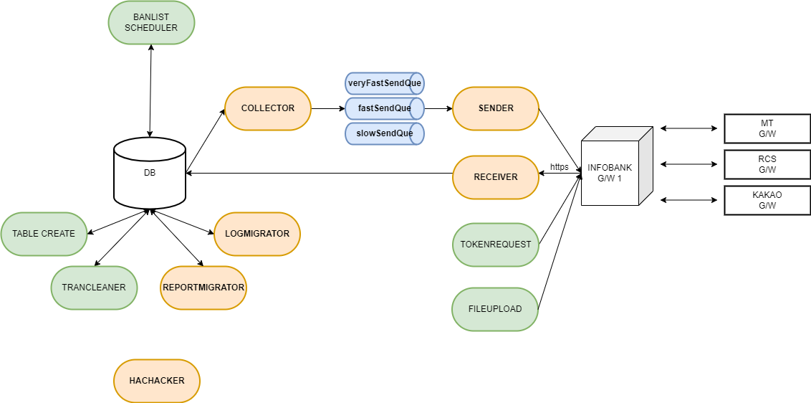

# OmniAgent

## **개요**

다양한 채널(SMS, MMS, 카카오 비즈메시지, RCS)의 메시지를 전송하기 위하여 고객사의 시스템에 배포되는 클라이언트 프로그램 입니다. 메시지 간 Fallback 기능을 사용할 수 있습니다.&#x20;

지정된 데이터베이스 테이블에 발송 데이터를 입력하면 이를 감지한 agent가 인포뱅크 G/W에 송신하여 이동통신사에 발송 요청 후 결과를 수신 받게 됩니다.&#x20;

## **SERVICE ARCHITECTURE**

* Collector: 데이터베이스를 조회하여 발송 대상 데이터를 SEND QUEUE에 저장
* Sender: SEND QUEUE의 데이터를 OMNI 통합메시지 API를 통해 인포뱅크 G/W로 송신
* Reciever: 리포트 API로 전송 결과를 수신하여 REPORT 테이블에 저장
* ReportMigrator: REPORT 테이블의 데이터를 TRAN 테이블로 이관
* LogMigrator: REPORT 수신이  완료된 TRAN 테이블의 데이터를 LOG 테이블로 이관
* Scheduler
  * FileUploadScheduler:
  * TableCreateScheduler:
  * TranCleanerScheduler: 결과 데이터가 갱신 되지 못한 발송 데이터를 LOG 테이블로 이관

## 메시지 처리 순서

1. MsgCollector가 전송 테이블을 주기적으로 감시하여 <mark style="color:red;">상태정보(msg\_status) 필드가 "1"</mark>인 발송 대상 메시지가 있는지 조회한다.&#x20;
2. 전송할 메시지가 있으면 SEND QUEUE에 적재한다.&#x20;
3. MsgSender가 SEND QUEUE에서 전송할 메시지를 꺼내온다.&#x20;
4. MsgSender가 꺼내온 메시지를 OMNI API 통합메시지 전송 규격에 맞추어 G/W에 전송한다.
5. MsgSender가 메시지 전송 후 SEND RESPONSE를 통해 접수 결과 수신 후 <mark style="color:red;">테이블의 메시지 상태정보(msg\_status)필드를 "2"로 업데이트 한다.</mark>&#x20;
6. MsgReciever가 메시지 전송 결과를 수신하여 DB에 반영한다.
7. ReportMigrator가 수신한 메시지 결과를 전송 테이블에 반영 후  <mark style="color:red;">테이블의 메시지 상태정보(msg\_status)필드를 "3"로 업데이트 한다.</mark>&#x20;
8. LogMigrator가 전송이 모두 완료된 메시지를 이력 테이블로 이동한다. <mark style="color:red;">테이블의 메시지 상태정보(msg\_status)필드를 "4"로 업데이트 한다.</mark> 이력 테이블로 옮겨진 메시지들은 전송 테이블에서 삭제된다.&#x20;

## 구성도

<figure><figcaption></figcaption></figure>

