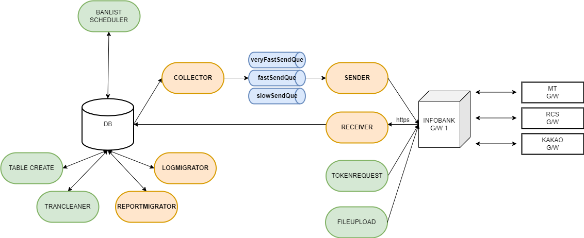

# Infobank OMNI Agent

<figure><figcaption></figcaption></figure>

Infobank OMNI Agent는 하나의 인터페이스에서 다양한 채널 메시지(문자, 카카오 비즈메시지, RCS 등)를 발송할 수 있는 통합 메시지 Agent 상품입니다. 지정된 데이터베이스 테이블에 발송 데이터를 입력하면 이를 감지한 Agent가 인포뱅크 G/W에 송신하여 이동통신사에 발송 요청 후 결과를 수신 받을 수 있으며, 비용, 수신자의 특성, 메시지의 도달률 등을 고려해 발송의 우선순위를 설정하여 발송할 수 있을 뿐만 아니라 모니터링, 통계, 장애를 통합하여 효율적으로 관리할 수 있습니다.&#x20;

## 시스템구성도

<figure><figcaption></figcaption></figure>

## **SERVICE ARCHITECTURE**

* Collector: 데이터베이스를 조회하여 발송 대상 데이터를 SEND QUEUE에 저장
* Sender: SEND QUEUE의 데이터를 OMNI 통합메시지 API를 통해 인포뱅크 G/W로 송신
* Reciever: 리포트 API로 전송 결과를 수신하여 REPORT 테이블에 저장
* ReportMigrator: REPORT 테이블의 데이터를 TRAN 테이블로 이관
* LogMigrator: REPORT 수신이 완료된 TRAN 테이블의 데이터를 LOG 테이블로 이관
* Scheduler
  * FileUploadScheduler: file\_upload 테이블의 이미지 파일 등록 및 관리
  * BanlistScheduler: msg\_banlist 테이블의 수신번호, 메시지 내용 항목에 대해 메시지 발송 시 차단
  * TableCreateScheduler: 주기적으로 테이블을 조회하여 존재하지 않는 테이블을 자동으로 생성
  * TranCleanerScheduler: 결과 데이터가 갱신 되지 못한 발송 데이터를 LOG 테이블로 이관

## 메시지 처리 순서

1. MsgCollector가 전송 테이블을 주기적으로 감시하여 <mark style="color:red;">상태정보(msg\_status) 필드가 "1"</mark>인 발송 대상 메시지가 있는지 조회한다.
2. 전송할 메시지가 있으면 SEND QUEUE에 적재한다.
3. MsgSender가 SEND QUEUE에서 전송할 메시지를 꺼내온다.
4. MsgSender가 꺼내온 메시지를 OMNI API 통합메시지 전송 규격에 맞추어 G/W에 전송한다.
5. MsgSender가 메시지 전송 후 SEND RESPONSE를 통해 접수 결과 수신 후 <mark style="color:red;">테이블의 메시지 상태정보(msg\_status)필드를 "2"로 업데이트 한다.</mark>
6. MsgReciever가 메시지 전송 결과를 수신하여 DB에 반영한다.
7. ReportMigrator가 수신한 메시지 결과를 전송 테이블에 반영 후 <mark style="color:red;">테이블의 메시지 상태정보(msg\_status)필드를 "3"로 업데이트 한다.</mark>
8. LogMigrator가 전송이 모두 완료된 메시지를 이력 테이블로 이동한다. <mark style="color:red;">테이블의 메시지 상태정보(msg\_status)필드를 "4"로 업데이트 한다.</mark> 이력 테이블로 옮겨진 메시지들은 전송 테이블에서 삭제된다.

## Point 1. 연동 편의성 향상

발송 채널별로 연동이 필요했던 기존 시스템을 하나로 통합하여 하나의 연동계정과 규격으로 다양한 채널을 단 한번의 연동으로 균일한 품질로 발송할 수 있고 발송 이력도 용이하게  관리할 수 있습니다.

## Point 2.  Fallback 기능으로 메시지 도달률 향상

Fallback(처리 실패 시 대체하여 작동) 기능으로 발송 실패 시 미리 지정해 놓은 대체 발송 순서에 따라 자동으로 발송되어 발송 성공률을 높여 줍니다. 발송 순서는 최대 3단계까지 지정이 가능하며, 발송 채널의 특성에 따라 메시지 내용을 다르게 구성할 수 있습니다.

## Point 3. 우수한 퍼포먼스와 속도

MSA(Micro Service Architecture) 구조와 HTTP/2를 기반으로 하는 gRPC(Google Remote Procedure Call) 프로토콜로 설계되어 서비스 및 프로젝트 단위로 배포가 가능하여 서비스 중단 없이 안정적으로 서비스를 제공하며 우수한 성능 및 빠른 처리 속도를 자랑합니다.

## Point 4. 서비스 구조 안정화

G/W의 응집력을 효율적으로 분산함으로 장애 위험도 및 발생 빈도와 개발 및 테스트 부담이 감소되고 요구 사항도 안정적으로 빠르게 반영할 수 있습니다.
